# EPR Imaging — Instruction Manual

*For the simple UI (`simple_main.py`), version 1.1.0. Woods Hole Oceanographic Institution.*

This manual is for the person who installs the app, imports a dive, runs it and uses what it produces. You do not need to read the code. Screenshots were taken from the current app, opened read-only on the J1754 workspace (the spectrum and anomaly maps come from J1758).

**Contents**

1. [What the app does](#1-what-the-app-does)
2. [Installation](#2-installation)
3. [Quick start](#3-quick-start)
4. [Concepts](#4-concepts)
5. [Working with products](#5-working-with-products)
6. [The products themselves](#6-the-products-themselves)
7. [Troubleshooting and degraded modes](#7-troubleshooting-and-degraded-modes)
8. [Known limitations](#8-known-limitations)

---

## 1. What the app does

EPR Imaging takes one ROV dive and turns it into mapped products. You give it four kinds of input:

- the vehicle **navigation**
- the **altitude** above the seafloor
- one or more **sensor channels**, for example CH4, CO2, O2, temperature and salinity
- the **downward video**

From these it makes tracklines, gridded depth and sensor maps, anomaly detections, still-frame sets, 3-D photogrammetry (orthomosaics, elevation models, point clouds, meshes), fauna detections and a survey report. When those exist, it can also gather them into one PDF catalogue.

Everything for one dive lives in one folder, the **workspace** (`<dive>.eprproj`). The app has one window per workspace, with three panels:

- **Products**: what exists, and a button to make more.
- **Trackline**: a map of the dive, where you choose time windows.
- **Log**: everything the app does, as it happens.

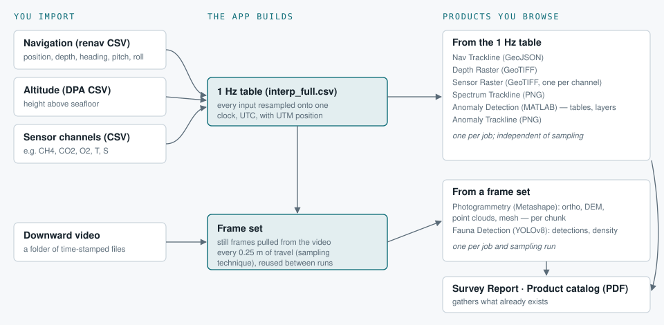

Two things are made first, and everything else is made from them:

1. **The 1 Hz table** (`inputs/interp_full.csv`). Every input is resampled onto one clock at one sample per second, in UTC, with a UTM position. Maps, rasters and anomaly detection are built from this table.
2. **Frame sets**. Still frames are pulled from the video at a fixed spacing along the track. Photogrammetry and fauna detection are built from them.

You can make each product on its own (**+ Generate new…** in the Products panel), or make all of them with their default settings (**Run ▸ Run all products (defaults)**). Either way you can limit the work to part of the dive by choosing a **job**, which is a named set of time windows (see [Concepts](#4-concepts)).

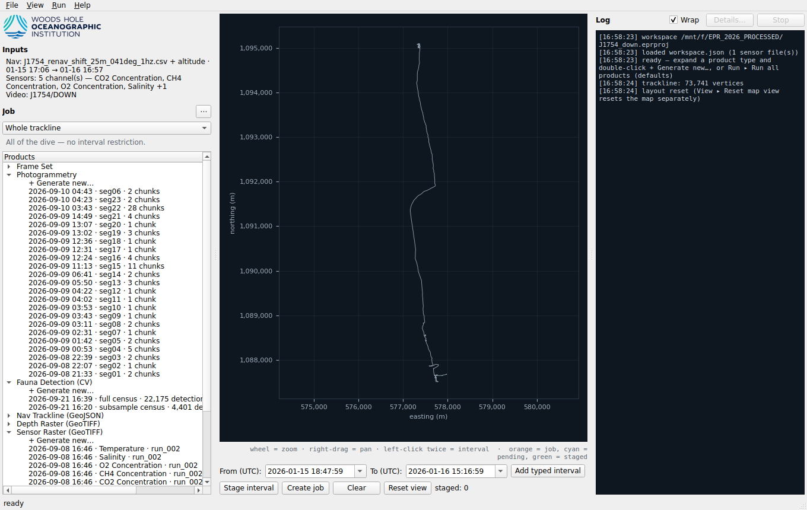

---

## 2. Installation

### 2.1 What you need

The app runs on **WSL2 on Windows 10/11** (with WSLg) or on **native Linux x86-64**, with **Python 3.12 or 3.13**. It was tested with 3.13.13 and 3.12.13.

With only the Python packages installed, the app starts and makes the products that come from the 1 Hz table and the frame sets. Each of the other components below adds specific products.

| Component | What it adds | Tested version | Without it |
|---|---|---|---|
| Python + PySide6, numpy, pandas, matplotlib | the app itself | 3.13.13 · 6.11.1 · 2.4.6 · 3.0.3 · 3.10.9 | the app does not start |
| scipy, rasterio, opencv-python, Pillow, utm, pykrige, plyfile, netCDF4 | rasters, frame extraction from video, PLY/NetCDF output | see `requirements.txt` | the affected step fails with one red `!!` line |
| pyproj | UTM layers for anomaly sites and segments | 3.7.2 | layers skipped (a `note:` line) |
| pyvista + pyvistaqt (+ vtk) | the full 3-D viewer window | 0.49.0 / 0.13.1 / 9.7.0 | "Open in 3-D viewer" is greyed out; the built-in 3-D preview still works |
| torch + torchvision + ultralytics | fauna detection (YOLOv8) | 2.14.0 / 0.29.0 / 8.4.155 | the fauna step fails |
| Fauna weights `mbari_315k_yolov8.pt` (132 MB, not in git) | fauna detection | MBARI FathomNet 315k | the fauna step fails with "detector weights not found" |
| NVIDIA GPU + driver (on WSL: the Windows driver with WSL CUDA support) | fast fauna inference; Metashape GPU | RTX 4500 Ada, 24 GB | runs on the CPU instead (much slower; the log says so) |
| **Agisoft Metashape Professional**, installed on Windows and activated | photogrammetry (orthomosaics, DEMs, clouds, meshes), and therefore the survey report | 2.3.1 | photogrammetry fails ("No Metashape found…"); the survey report fails because it needs the merged orthomosaic |
| **MATLAB** on PATH + **Signal Processing Toolbox** | anomaly detection (`GrapherMatrix.m`) | R2026a (R2019a or later is required) | anomaly detection fails ("MATLAB unavailable"); the anomaly map then has no windows |
| Google Chrome / Chromium / Edge | the high-quality catalogue PDF | Chrome on Windows | the catalogue falls back to a plainer PDF drawn with matplotlib (same content) |
| QGIS | opening the generated `.qgs` projects | — | the projects are still written |

You do not need ffmpeg or COLMAP. Video decoding uses the FFmpeg bundled inside `opencv-python`.

**Supported photogrammetry platform: WSL2 + Windows Metashape Professional 2.x.** The app finds `metashape.exe` under `C:\Program Files\Agisoft\…` on its own. When you run from WSL, keep workspaces on a drive Windows can see (`/mnt/<letter>/…`). `\\wsl.localhost` paths are slow and unreliable for Metashape.

### 2.2 Install steps

1. **Get the code** and note the commit you installed (`git log -1`).
   ```bash
   git clone git@github.com:boland25t/epr_imaging.git
   cd epr_imaging/epr_imaging
   ```
2. **Create an environment:**
   ```bash
   python3 -m venv .venv && . .venv/bin/activate && pip install -U pip
   ```
3. **Install torch first**, from the index that matches your hardware:
   ```bash
   # NVIDIA GPU
   pip install torch torchvision --index-url https://download.pytorch.org/whl/cu130
   # or CPU only
   pip install torch torchvision --index-url https://download.pytorch.org/whl/cpu
   ```
4. **Install the rest:**
   ```bash
   pip install -r requirements.txt
   ```
   `requirements.txt` sets minimum versions at the tested versions. `requirements-lock.txt` pins the exact tested set (Python 3.13.13, Linux x86-64, CUDA 13.0 torch).
5. **Fauna weights.** Copy `mbari_315k_yolov8.pt` to the machine and point the app at it:
   ```bash
   export EPR_FAUNA_WEIGHTS=/path/to/mbari_315k_yolov8.pt
   # optional, used only if per-bucket thresholds are switched on:
   export EPR_FAUNA_DEPLOY_CONFIG=/path/to/deploy/deploy_config.json
   ```
   Put these lines in `~/.bashrc` so every launch sees them. For a single run you can also type the path under **Generate new… ▸ Fauna Detection ▸ Detector weights**.
6. **WSL only:**
   - For a GPU, install the NVIDIA **Windows** driver with WSL CUDA support. Do not install a Linux driver inside WSL.
   - The launcher sets `QT_QPA_PLATFORM=xcb` for you. A Wayland window renders blank.
7. **Metashape** (for photogrammetry and the survey report): install Metashape Professional 2.x on Windows and activate it. Nothing else is needed. The app copies its worker script to `C:\Users\Public\epr_metashape\` on each run.
8. **MATLAB** (for anomaly detection): install MATLAB with the Signal Processing Toolbox on the Linux/WSL side, so that `matlab` is on PATH (for example a `/usr/local/bin/matlab` symlink). Use a licence that works without a network. See [MATLAB sign-in](#73-matlab-sign-in).
9. **Optional:** Chrome on Windows (default install path), or `chromium` / `google-chrome` on Linux, for the better catalogue PDF. QGIS to open the `.qgs` outputs.
10. **Launch:**
    ```bash
    ./launch_simple_ui.sh /path/to/<dive>.eprproj     # open one workspace
    ./launch_simple_ui.sh --pick                       # choose a workspace in a folder dialog
    ```
    The launcher works from any directory. It uses `$EPR_PYTHON` if that is set, otherwise `<repo>/.venv/bin/python`, otherwise `python3`. The direct equivalent is `python simple_main.py [workspace]`. With no workspace given, a folder dialog opens at the last workspace you used (remembered in `~/.epr_simple_ui.json`).

### 2.3 Offline and at-sea notes

- **Python packages:** before sailing, build a wheelhouse on a connected machine with the same OS, Python version and architecture:
  ```bash
  pip download -d wheelhouse torch torchvision --index-url <cuda or cpu url>
  pip download -d wheelhouse -r requirements.txt
  ```
  At sea, install with `pip install --no-index --find-links wheelhouse …`. A CUDA torch wheelhouse is about 3 GB; the CPU build is much smaller.
- **Model weights** are a local file. Nothing is downloaded when the detector runs. Carry the 132 MB `.pt` (and `deploy_config.json` if you use it).
- **Metashape:** activate the licence before sailing. A node-locked activation works offline. A floating licence needs its licence server on the ship network.
- **MATLAB:** an online (named-user) licence fails without a network, and the app stops the run when MATLAB asks for a sign-in. Use an offline-activated licence file.
- **Chrome**, PDF printing and everything else run fully offline. The survey report HTML only loses its web fonts, which is cosmetic.
- **Moving a workspace to another machine:** the products come with it, but the links to the raw inputs do not, because `workspace.json` stores absolute paths. Re-import navigation, video and sensors through the File menu on the new machine before running anything that re-reads raw data.
- The app makes no network calls, apart from the survey report's font link.

### 2.4 First-run checklist

- [ ] The window opens with the WHOI logo at top left and the title `EPR Imaging — <dive>`. The Log does **not** show a red `product_catalog unavailable — …` line. If it does, a required package is missing, and the line names it.
- [ ] `python -c "import torch, ultralytics, pyproj; print(torch.cuda.is_available())"` succeeds in the same environment the launcher uses.
- [ ] `ls "$EPR_FAUNA_WEIGHTS"` shows the weights file.
- [ ] (WSL) `ls "/mnt/c/Program Files/Agisoft"/*/metashape.exe` finds a file, and Metashape opens once on Windows, activated.
- [ ] `which matlab` succeeds. Start MATLAB interactively once to confirm the licence.
- [ ] Run a small job before running the whole dive (see [Quick start](#3-quick-start), steps 7–8). A run ends with a verdict line. Each failed step names its cause on a red `!!` line, which you can match to the table in 2.1.
- [ ] Build the product catalogue once. `chrome: not found — falling back to matplotlib` in the log is not an error.

---

## 3. Quick start

This is the whole path for a new dive: create a workspace, import, run, browse, and build the catalogue.

**Step 1 — Create a workspace.** Choose **File ▸ New workspace…** (Ctrl+N) and give it a name such as `J1760_down`. The app adds `.eprproj` and opens a new window on the empty workspace. **File ▸ Open workspace…** (Ctrl+O) opens an existing one.

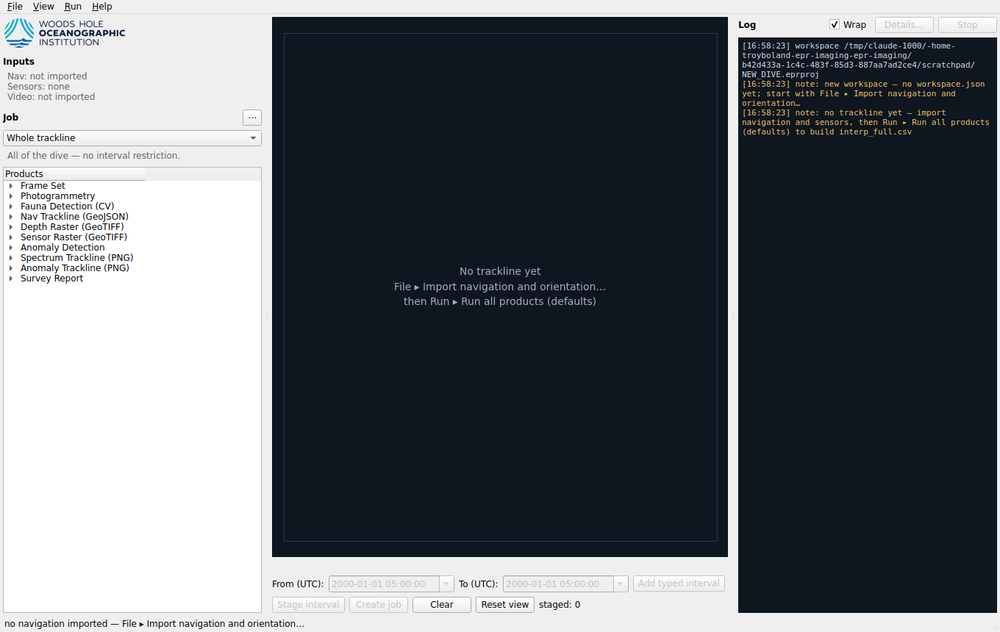

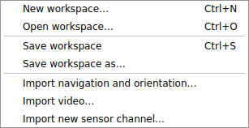

**Step 2 — Import navigation and altitude.** Choose **File ▸ Import navigation and orientation…**.

- **Renav CSV (headerless):** choose the renavigated navigation file. The table shows its first rows, headed by column number.
- **Column spin boxes:** set which column holds date, clock time, latitude, longitude, depth, heading, pitch and roll. The chosen names appear in the table header, so you can check them against the data.
- **Negate depth:** tick this only if your file stores depth as a positive number and you want it stored as negative (Z-up).
- **DPA altitude CSV (optional):** the altimeter file, with the names of its date, time and altitude columns. The defaults are `DATE`, `TIME` and `ALTITUDE(m)`.

Timestamps are read as UTC. When you press OK, the import is saved to the workspace immediately.

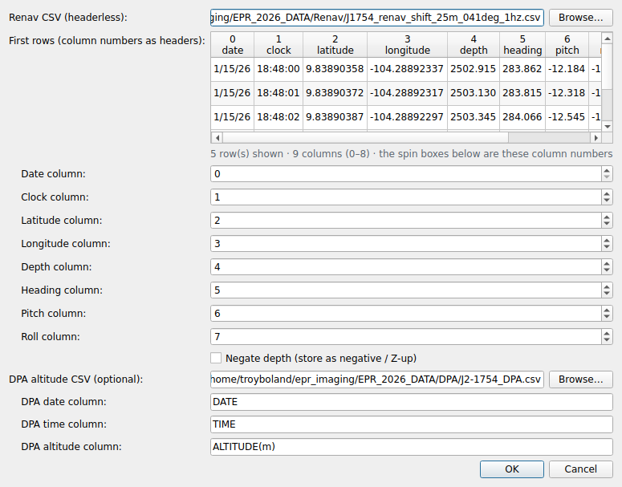

**Step 3 — Import video.** Choose **File ▸ Import video…**. Pick the folder that holds the downward video files and enter the **filename time format**: the strftime pattern that turns a filename into its start time, for example `%Y%m%d_%H%M%S` for `20260115_170600.mp4`. The field's default (`%Y_%m_%dT%H_%M_%S`) is only an example. Check it against your own filenames: a wrong format is only discovered later, when frames are extracted.

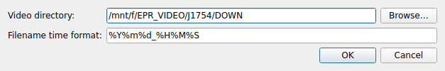

**Step 4 — Import sensor channels.** Choose **File ▸ Import new sensor channel…**. Each import adds **one channel**, so repeat it for every channel.

- **Sensor CSV:** the file must have a header row.
- **Timestamp column:** the column that holds the time.
- **Channel source column:** the column that holds the values.
- **Display name** and **Units:** how the channel is labelled in the products.
- **Time delay (s):** positive means the sensor reading lags the vehicle position by that many seconds.

Re-importing the same source column replaces the earlier entry rather than adding a copy.

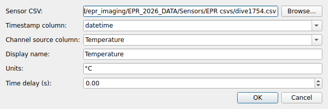

**Step 5 — Check the Inputs block and save.** The **Inputs** block under the logo lists what the next run will read: the navigation file and its time span, the sensor channels and the video folder. Hover over it to see the full paths. Each import is already saved. **File ▸ Save workspace** (Ctrl+S) saves again, and the log confirms `saved workspace.json`. If a save ever fails, the block shows a red "● unsaved changes — runs read the file on disk" line. Runs read the file on disk, not what is on screen.

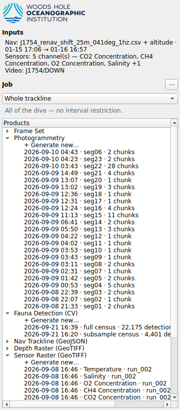

**Step 6 — Build the 1 Hz table and the map.** A new workspace has no trackline yet, because the map is drawn from the 1 Hz table. The quickest way to build that table is to expand **Nav Trackline (GeoJSON)** in the Products panel and double-click **+ Generate new…**. The dialog has a single **Run** button. The step takes seconds, and the map appears when it finishes. **Run all products** also builds the table as its first step.

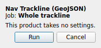

**Step 7 — Make a small test job (recommended).** Before processing hours of video, try the whole chain on a few minutes of it.

1. Zoom the map with the mouse wheel, and pan by dragging with the right (or middle) button.
2. Left-click one point on the track, then a second point. The first click drops a pink star, and the readout under the map says "pick open…". **Esc** cancels a half-made pick.
3. The span between the two clicks turns **cyan** (pending). Press **Stage interval** and it turns **green** (staged). Add as many intervals as you need. You can also type exact UTC times in **From / To** and press **Add typed interval**.
4. Press **Create job** and type a name, or leave it blank for an automatic name.

A click more than 30 pixels from the track is ignored, and the log says so. An interval that runs past the dive is clipped to the dive, and one entirely outside it is rejected.

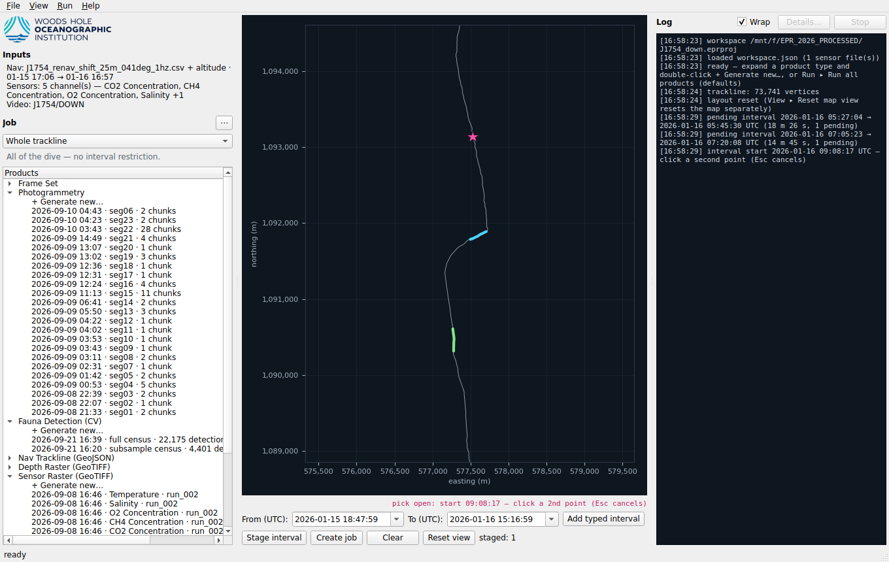

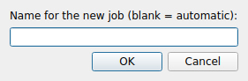

If a job is already selected when you press Create job, the app first asks whether the new job should also include that job's intervals. **No** (the default) makes a job with only the staged intervals. A job is never changed after it is created: "adding" to a job always makes a new one.

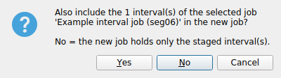

**Step 8 — Run all products for the test job.** With the job selected in the **Job** selector, choose **Run ▸ Run all products (defaults) — <job>…**. The menu item always names the job it will run on. A confirmation lists:

- the job
- every step
- the expected duration
- any existing files that will be replaced

Nothing starts until you press **Start run**.

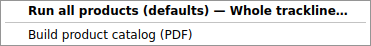

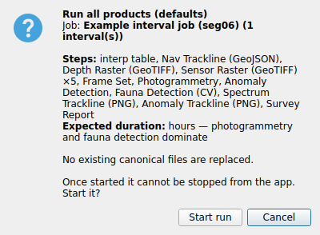

**Step 9 — Watch the log.** Every step prints a `--- step ---` header and ends with `--- step: ok in …` or a red `!!` line naming the cause. The last line is a verdict. The status bar at the bottom of the window repeats it, in red if anything failed. Only one task runs at a time; the Run menu is disabled until it ends. How to read the log is described in [5.4](#54-reading-the-log).

**Step 10 — Run the whole dive.** Select **Whole trackline** in the Job selector and choose **Run ▸ Run all products (defaults) — Whole trackline…**. Expect hours: photogrammetry and fauna detection take most of the time. On a dive that already has products, the confirmation lists the canonical files the run will replace. Those files are **moved** to `_superseded/<timestamp>/` first, not deleted (see [7.5](#75-recovering-replaced-files-_superseded)).

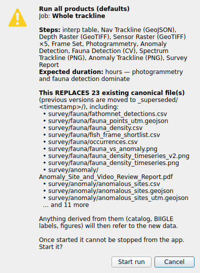

> **A run cannot be stopped from the app.** The Stop button stays greyed out in this version. If you close the window during a run, the app asks first. The program then keeps working in the background until the run finishes, and the remaining log lines are lost.

**Step 11 — Browse and build the catalogue.** Expand a product type and double-click an entry to open it in a viewer (chapter 5). When you have what you need, choose **Run ▸ Build product catalog (PDF)**. It gathers the selected job's products into `survey/catalog/catalog_<dive>_<YYYYmmdd_HHMM>.pdf`.

**Help ▸ Quick start** in the app shows a one-screen summary of this chapter.

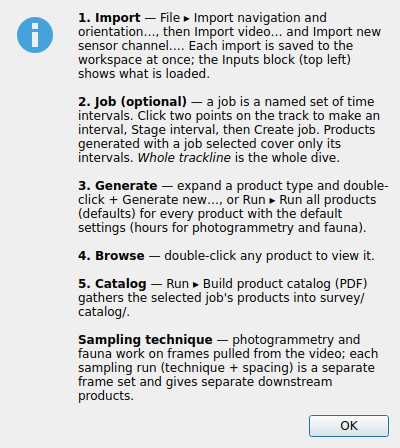

---

## 4. Concepts

### 4.1 Workspace

A workspace is a folder named `<dive>.eprproj`. Everything about one dive is in it:

| Path inside the workspace | What it is |
|---|---|
| `workspace.json` | the imports (paths to the raw navigation, altitude, sensor and video inputs, with their column settings) and the jobs |
| `inputs/interp_full.csv` | the 1 Hz table; `interp_full.meta.json` records which inputs it was built from |
| `survey/…` | products for the **Whole trackline** |
| `survey/jobs/<job_id>/…` | products for one job |
| `survey/frame_sets/<whole or job_id>/set_<stamp>/` | frame sets |
| `survey/catalog/` | product catalogue PDFs |
| `SURVEY_REPORT.html` | the dive's survey report |
| `_superseded/<UTC stamp>/` | earlier versions of files a later run replaced |
| `.epr_run.lock` | present only while a run is working in this workspace |

The raw inputs themselves (navigation CSVs, video) stay where they are. The workspace only records their paths.

### 4.2 Job, intervals and Whole trackline

An **interval** is a time window on the dive, `[start, end]` in UTC. A **job** is a named set of one or more intervals. Every product you make while a job is selected covers only that job's intervals, and is stored and listed under that job.

**Whole trackline** is the job that is always there. It has no intervals, which means the whole dive. The job you select in the **Job** selector sets three things:

- which products the tree lists
- what **+ Generate new…** and **Run all products** work on
- which products **Build product catalog** gathers

A job's intervals are listed under the selector and drawn in **orange** on the map, which zooms to them. Open the **⋯** button, or right-click the selector, to rename or delete a job. A job that still owns products is not deleted; the app says why and suggests renaming it instead. The Whole trackline cannot be renamed or deleted.

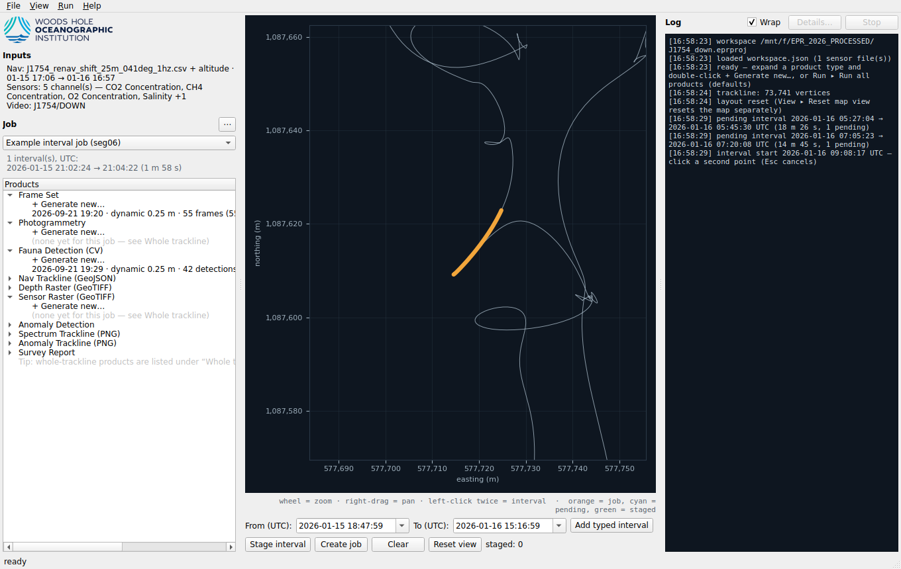

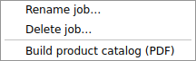

### 4.3 Sampling technique and sampling run

Photogrammetry and fauna detection work on still frames taken from the video. How those frames are chosen is the **sampling technique**. The only technique in this version is **dynamic**. It takes a frame every **Target spacing** metres of along-track travel (default **0.25 m**). While the vehicle is stationary it still takes at least **Minimum frequency** frames per second (default **0.1 Hz**, one frame every 10 s).

The sample times form one fixed grid for the whole dive, anchored at the first navigation fix. Any job's samples are therefore a subset of the whole-dive grid. Before extracting frames, the app looks for frames already extracted at the same times and reuses them, so overlapping jobs do not decode the same video twice.

A **sampling run** is one frame set made with one sampling technique and spacing. Products are divided into two kinds:

- **Sampling-dependent** (Frame Set, Photogrammetry, Fauna Detection): one entry **per job and sampling run**. The sampling appears at the start of the entry's label, for example `dynamic 0.25 m · …`. Changing the spacing makes a separate frame set and separate downstream products.
- **Sampling-independent** (everything else): made once per job from the 1 Hz table, whatever frame sets exist.

### 4.4 Product types

| Product type (as in the tree) | One-line description | Where it lands (Whole trackline; jobs use `survey/jobs/<job_id>/…`) |
|---|---|---|
| Frame Set | still frames from the video on the sampling grid, with a position for each | `survey/frame_sets/<scope>/set_<stamp>/segment_*/frames/*.jpg` + `interp.csv`, `set_meta.json` |
| Photogrammetry | Metashape reconstruction, in chunks of 250–350 frames: orthomosaic, DEM, point clouds, mesh, report | `survey/photogrammetry/run_<stamp>__<sampling>/chunk_NN/`; merged mosaics in `survey/photogrammetry/merged/` |
| Fauna Detection (CV) | megafauna detections on every frame of a frame set, with per-frame counts and densities | `survey/fauna/` (whole dive, default sampling: the "census"); other runs in `<scope>/fauna_runs/<DIVE>_fauna_<stamp>__<sampling>/survey/fauna/` |
| Nav Trackline (GeoJSON) | the vehicle track as a line | `survey/nav_trackline/trackline.geojson` |
| Depth Raster (GeoTIFF) | water depth along the track on a grid | `survey/nav_depth/run_NNN/nav_depth.tif` |
| Sensor Raster (GeoTIFF) | one sensor channel interpolated onto a grid | `survey/sensor_2d/<channel>/run_NNN/<channel>_2d.tif` |
| Anomaly Detection | time windows and sites where the sensor channels depart from their baseline, by confidence tier | `survey/anomaly/` |
| Spectrum Trackline (PNG) | a map per channel, the track coloured by log10 value | `survey/spectrum_trackline/spectrum_<scope>_<stamp>.png` |
| Anomaly Trackline (PNG) | a map of the track with the anomaly windows coloured by tier | `survey/anomaly_trackline/anomaly_<scope>_<stamp>.png` |
| Survey Report | a self-contained HTML report for the dive | `SURVEY_REPORT.html` (jobs: `survey/jobs/<job_id>/SURVEY_REPORT_<stamp>.html`) |
| *(Run menu)* Product catalog | a PDF preview of what the workspace holds | `survey/catalog/catalog_<dive>_<stamp>.pdf` |

**Instance labels.** Each entry under a type reads `<date time> · <characteristic>`, for example `2026-09-10 04:43 · seg06 · 2 chunks`. The date and time say **when the file was made**, on the computer's local clock. It is **not** the observation time. The characteristic is what tells entries of one type apart: sampling, frame count, channel, cell size or run folder.

---

## 5. Working with products

### 5.1 The product tree

Each product type is a row in the tree. Expand it to see **+ Generate new…** followed by the entries for the selected job. Entries under a type are listed newest first.

- **Double-click** an entry, or right-click ▸ **View**, to open it in a viewer.
- Right-click ▸ **Open containing folder** shows its folder in the file manager (Windows Explorer on WSL).
- Double-click **+ Generate new…** to make another. The Generate dialog shows the product's settings with their default values.
  - **Run with these settings** uses exactly the values shown. Pressing Enter does the same.
  - **Run with defaults** ignores the form.
  - The dialog title and heading name the job it will run on.
- When a Whole-trackline Generate would replace canonical files (for example the fauna census or the merged mosaics), a confirmation lists them first.

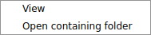

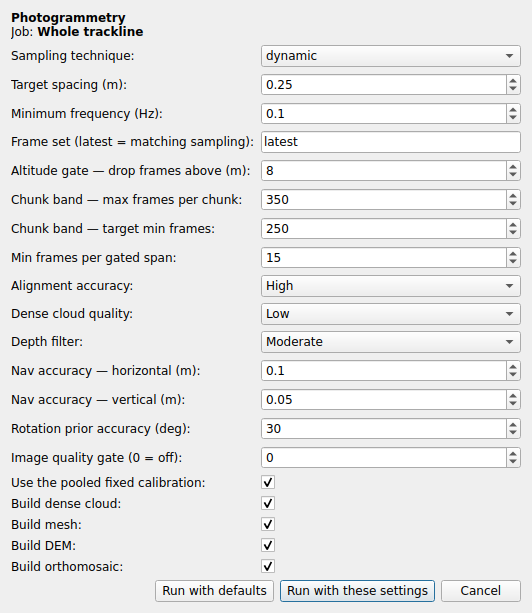

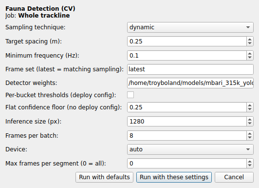

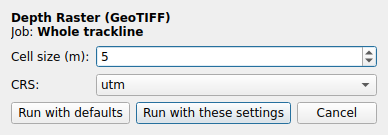

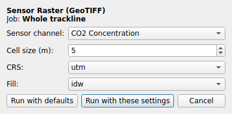

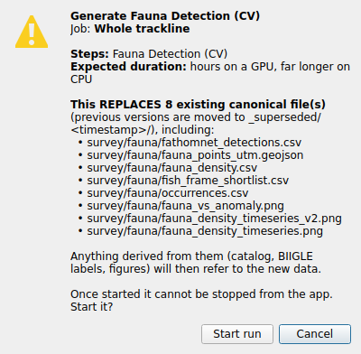

### 5.2 Viewers

A viewer window has one tab per file of the product. A tab is only loaded when you open it, so products with dozens of files open quickly. The viewer opens on the first picture. What each kind of file shows:

| File | What the viewer shows |
|---|---|
| PNG / JPG | the image, scaled to fit |
| GeoTIFF, one band (depth, sensor, DEM) | a colour map (viridis) with a colour bar giving the quantity and units. The colour range spans the 2nd–98th percentile of values; the axes are easting/northing in metres; the trackline is drawn over it. Long, thin rasters are stretched to fit, and the title says "aspect stretched to fit". No-data cells are background. |
| GeoTIFF, RGB (orthomosaic) | the picture, from a reduced-resolution read |
| CSV | a table of the **first 500 rows**, with a line giving the total row count. For the full file, use Open containing folder. |
| GeoJSON | the features plotted, with the trackline behind them when both are in UTM |
| Frame set folder | a contact sheet of 12 frames sampled evenly across the set, with the total count |
| PLY / OBJ (clouds, mesh) | a rotatable 3-D **preview** of at most 120,000 points read from across the file (drag to rotate). The heading states the file size and vertex count. **Open in 3-D viewer** opens the full PyVista viewer when it is installed. |
| PDF / HTML (reports) | **Open in external viewer** and **Open containing folder** buttons |
| `.psx` (Metashape project) | no viewer; Open containing folder |

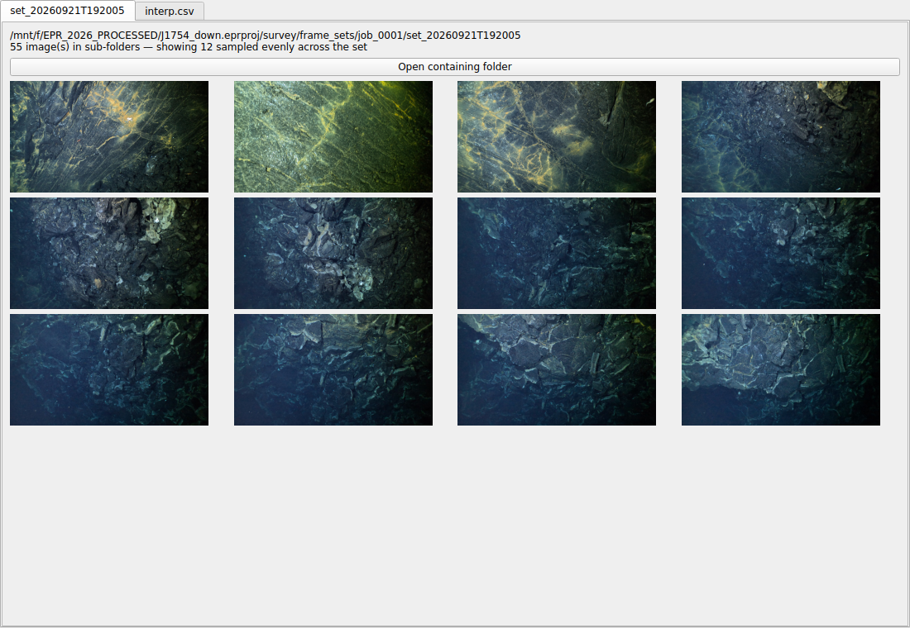

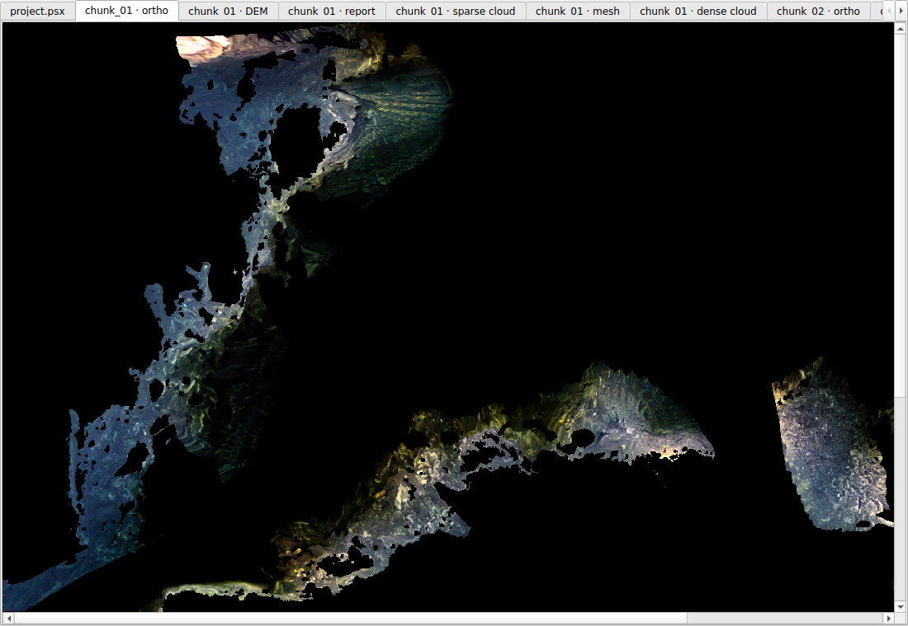

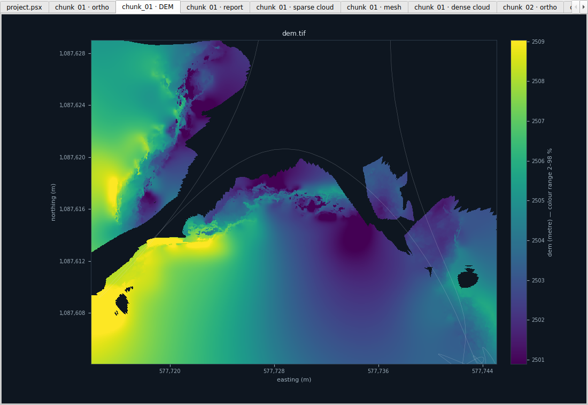

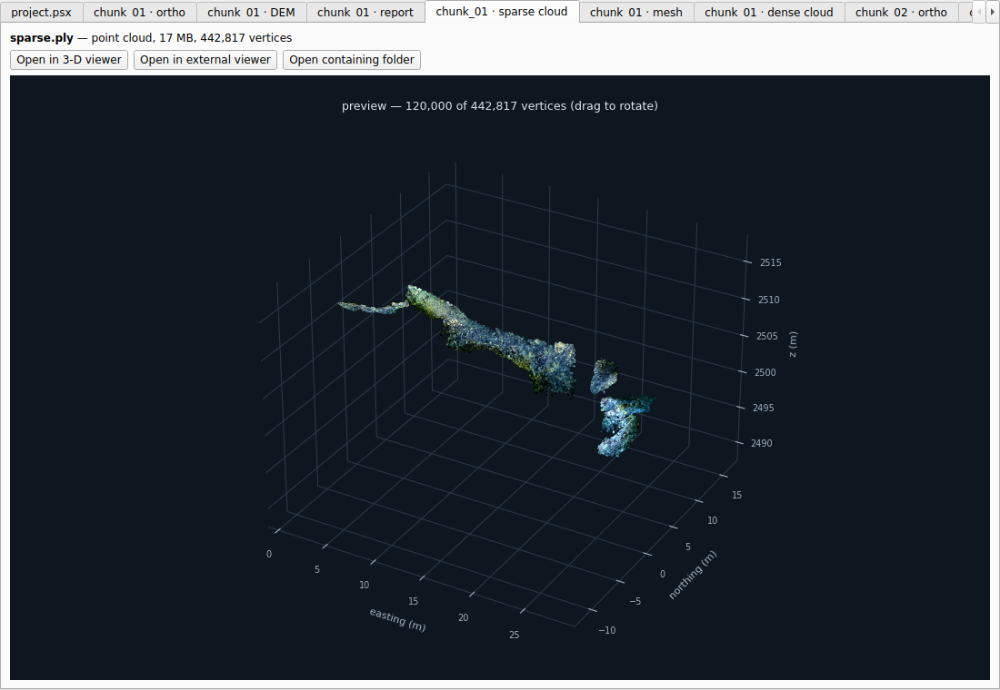

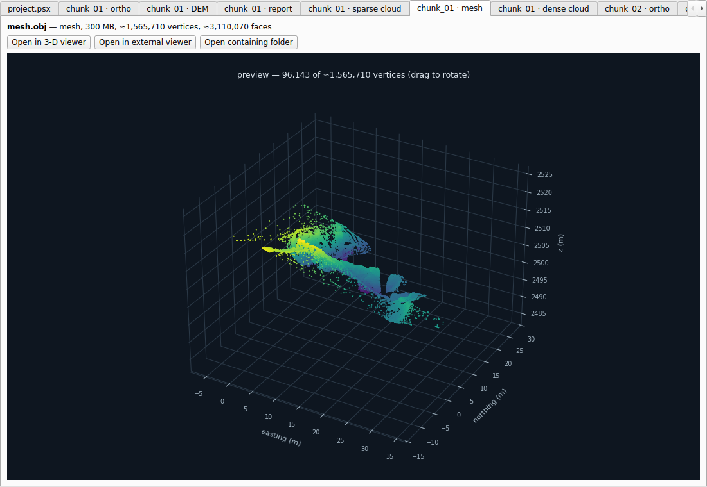

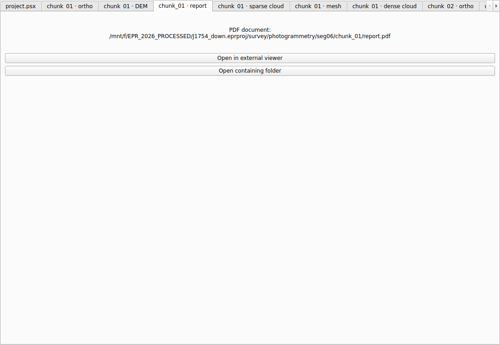

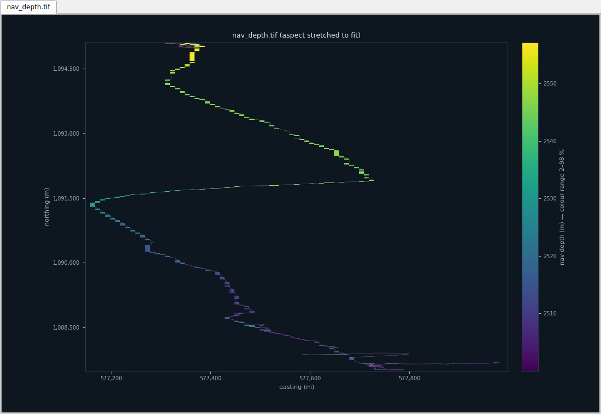

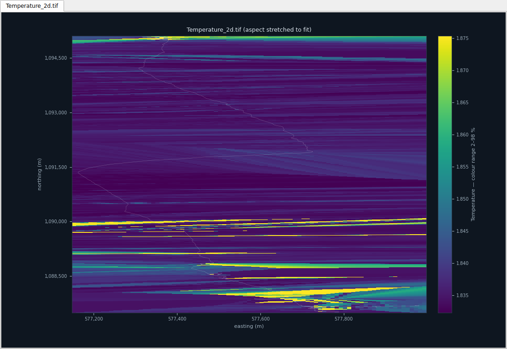

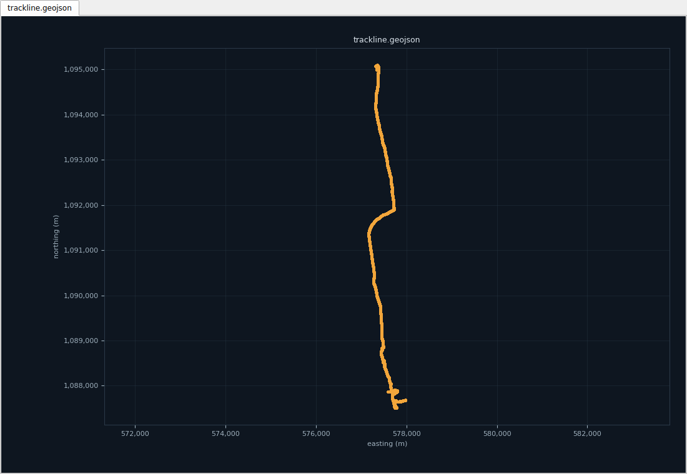

### 5.3 The product catalogue (PDF)

**Run ▸ Build product catalog (PDF)**, or **⋯ ▸ Build product catalog (PDF)**, gathers everything the selected job already has on disk into one PDF. The catalogue is not a pipeline step: it computes nothing new. It copies counts and tiers out of the product tables, and draws reduced-size pictures of products that already exist. A product family that is not on disk shows a grey "not present" line, so you can tell "not run yet" from "missing".

The PDF is written to `survey/catalog/catalog_<dive>_<YYYYmmdd_HHMM>.pdf`, with its HTML and images beside it. It is not listed in the product tree; open it from the folder. With Chrome, Chromium or Edge installed, the PDF is printed from HTML. Without one, the log says `chrome: not found — falling back to matplotlib` and a plainer PDF with the same content is drawn.

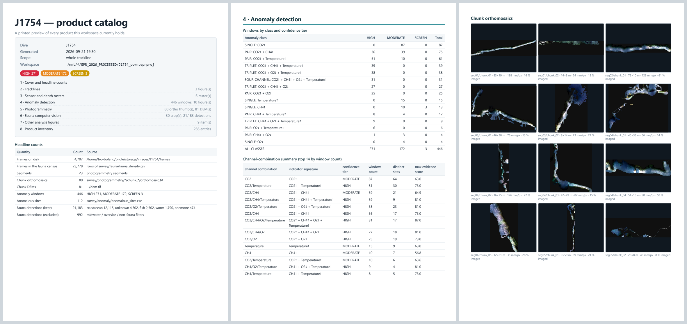

### 5.4 Reading the log

Every line starts with the local time, `[HH:MM:SS]`. The line types:

| Line | Meaning |
|---|---|
| plain text (light) | progress: what is being read, built or written, and where |
| `=== <Product> — <Job> ===` | one product starts |
| `--- <step> ---` … `--- <step>: ok in 12.3s -> <file> ---` | one step of Run all products starts and ends |
| amber `note:` | a warning. The step **continued**, but something was skipped, clipped, reused or assumed. Read these. |
| red `!! …` | a **failure**. One compact line naming the cause. Failures are counted, and the status bar turns red at the end of the task. In Run all products, a failed step does not stop the next steps. |
| dim `… N line(s) of detail collapsed — press "Details…" above to read them` | the technical traceback behind the last failure, folded away. **Details…** at the top of the Log prints it. |
| `DEFAULT RUN FINISHED WITH n OF m STEP(S) FAILED (… min): …` | the verdict of Run all products, naming the failed steps. A clean run ends `DEFAULT RUN COMPLETE — m/m steps ok`. |

**Wrap** switches line wrapping. The log keeps the latest 20,000 lines.


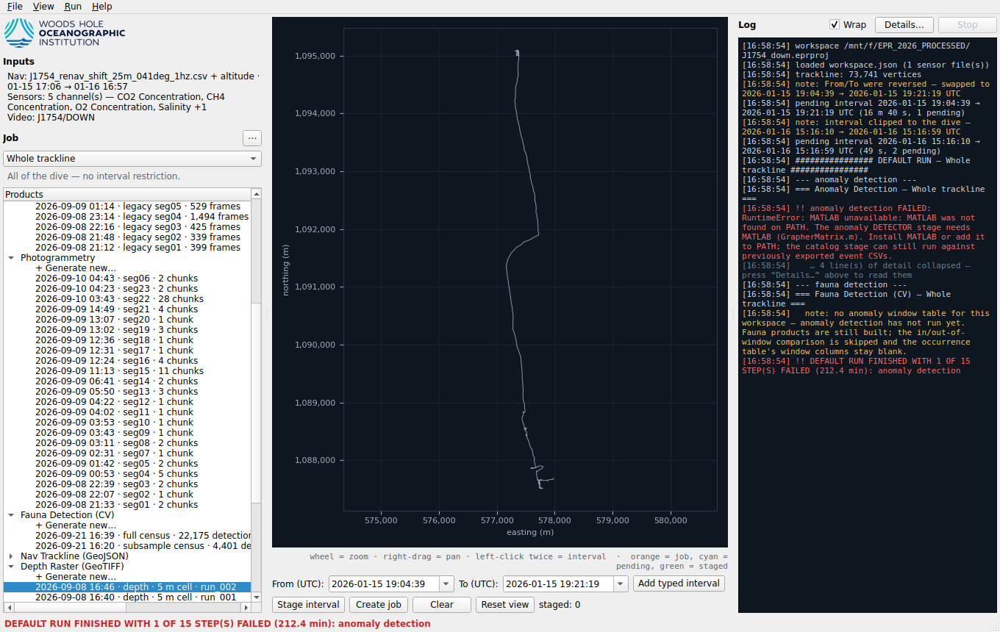

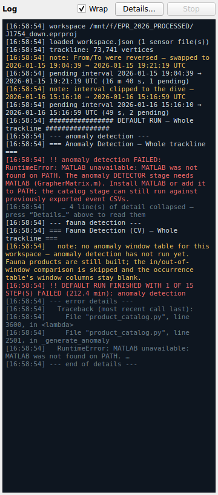

---

## 6. The products themselves

This chapter describes how each product is made and what its files contain. It does not interpret the results.

### 6.1 Conventions used everywhere

| Item | Convention |
|---|---|
| Time | **UTC** throughout the data. `unix_time` is seconds since 1970-01-01 UTC. `timestamp_iso` in `interp_full.csv` is UTC even though it carries no `Z`. Anomaly tables use ISO times ending in `Z`. |
| Time on screen | The map, job intervals and From/To fields are UTC (labelled). **Exceptions:** log line stamps, instance labels in the tree, and the `<stamp>` in file and folder names use the computer's local clock. |
| Horizontal position | `lat`, `lon` in decimal degrees (WGS84). `easting`, `northing` in metres, UTM. The zone comes from the data: the EPR dives are zone 13 N, **EPSG:32613**. Rasters can be written in UTM (default) or reprojected to WGS84 (EPSG:4326). |
| Depth | `depth` in metres, **negative down** (−2555 = 2555 m below the surface). `water_depth` in metres, positive down. The Depth Raster holds `water_depth` (positive). |
| Altitude | `alt` in metres above the seafloor, from the DPA altimeter. **0.6 m is the altimeter's dropout value, not a real altitude.** |
| Attitude | `heading`, `pitch`, `roll` in degrees, as in the navigation file. |
| Sensor channels | in the units you gave at import, with the import's time delay applied |
| Rasters | float32 GeoTIFF, NaN = no data, 5 m cells by default |

### 6.2 The 1 Hz table (`inputs/interp_full.csv`)

The table is built by the pipeline from the imported navigation, altitude and sensor files. Every source is interpolated onto a one-second grid. The columns are:

- `timestamp_iso`, `unix_time`
- `lat`, `lon`, `easting`, `northing`, `utm_zone`
- `alt`, `water_depth`, `depth`
- `heading`, `pitch`, `roll`
- one column per sensor channel, named by its display name

`interp_full.meta.json` records a fingerprint of the inputs used. Rows outside the span that has real navigation positions are ignored when the table is read, so tracks and products start and end where the navigation does.

### 6.3 Nav Trackline

A GeoJSON line of the track in UTM: every 1 Hz position for the Whole trackline, and one part per interval for a job. The label gives the vertex count.

### 6.4 Depth Raster

`water_depth` from the 1 Hz table, placed into grid cells (default 5 m) along the track. **There is no filling between track lines**: only cells the vehicle passed over carry a value, and where several samples fall in one cell the last one is kept. A `.meta.json` beside the file records the cell size and CRS. Every Generate makes a new `run_NNN` folder.

### 6.5 Sensor Raster

One channel from the 1 Hz table, gridded at 5 m (default) over the track's bounding box plus three cells.

- **Fill `idw`** (the default): inverse-distance weighting of the 16 nearest samples, power 2, computed for **every cell of the rectangle**.
- **`rbf`**: thin-plate spline.
- **`none`**: track cells only.

The IDW and RBF surfaces are interpolated from along-track measurements. They are not a synoptic field, and they extend beyond the data (see chapter 8). One raster is made per channel per run.

### 6.6 Spectrum Trackline

One panel per channel ("all" by default). Each 1 Hz sample inside the job is plotted at its position, coloured on a **log10** scale with the *turbo* colour map. The colour range runs from the 2nd to the 99.5th percentile of the channel's **positive** values; non-positive values are left out. The whole-dive track is drawn in grey behind the samples.

### 6.7 Anomaly Detection

Needs MATLAB. It runs in two stages.

1. **Detector (MATLAB).** `GrapherMatrix.m` runs a matrix of detection strategies (4 run configurations × 160 strategies per channel) over the sensor channels of the 1 Hz table. Two export scripts then write per-channel event lists.
2. **Catalogue (Python).** The per-channel events are fused into:
   - **windows**: time spans where one or more channels depart from baseline, each with a **confidence tier** (HIGH, MODERATE or SCREEN) and a class naming the channels and their directions, for example `PAIR: CO2↑ + CH4↑`
   - **sites**: ranked locations that group windows

For the Whole trackline the step also writes UTM GeoJSON layers and `window_context.csv`. That file tags each window **station** (the vehicle's median speed during the window is below 0.08 m/s) or **transit** (otherwise).

Files in `survey/anomaly/`:

- `anomaly_windows_all.csv`
- `anomalous_sites.csv`
- `anomalous_sites.geojson`
- `anomalous_sites_utm.geojson`
- `anomaly_segments_utm.geojson`
- `window_context.csv`
- `anomaly_combination_summary.csv`
- `video_review_clips.csv`
- `Anomaly_Site_and_Video_Review_Report.pdf`
- a `qgis/` folder

The label gives the number of windows and sites.

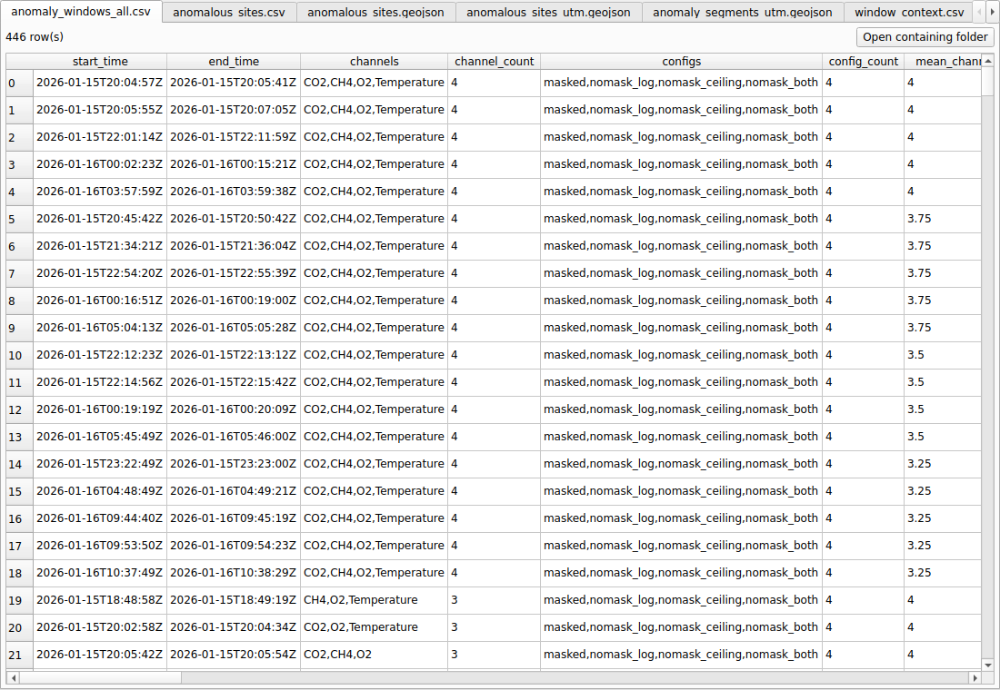

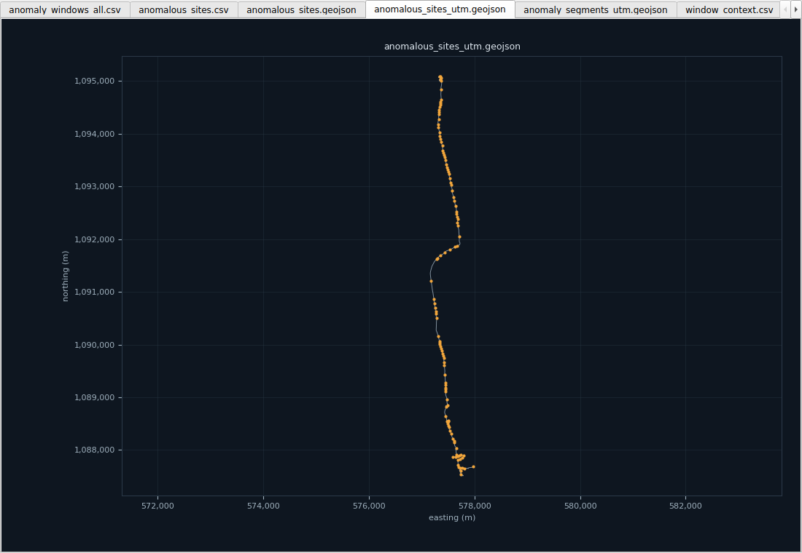

### 6.8 Anomaly Trackline

A map of the dive track with each anomaly window drawn over its stretch of track, coloured by tier: HIGH red, MODERATE orange, SCREEN yellow. Ranked sites are drawn as white circles. For a job, the job's intervals are drawn in white and only windows overlapping them are shown. **Transit windows only** hides the windows tagged *station*. The viewer also offers the anomaly GeoJSON layers as tabs.

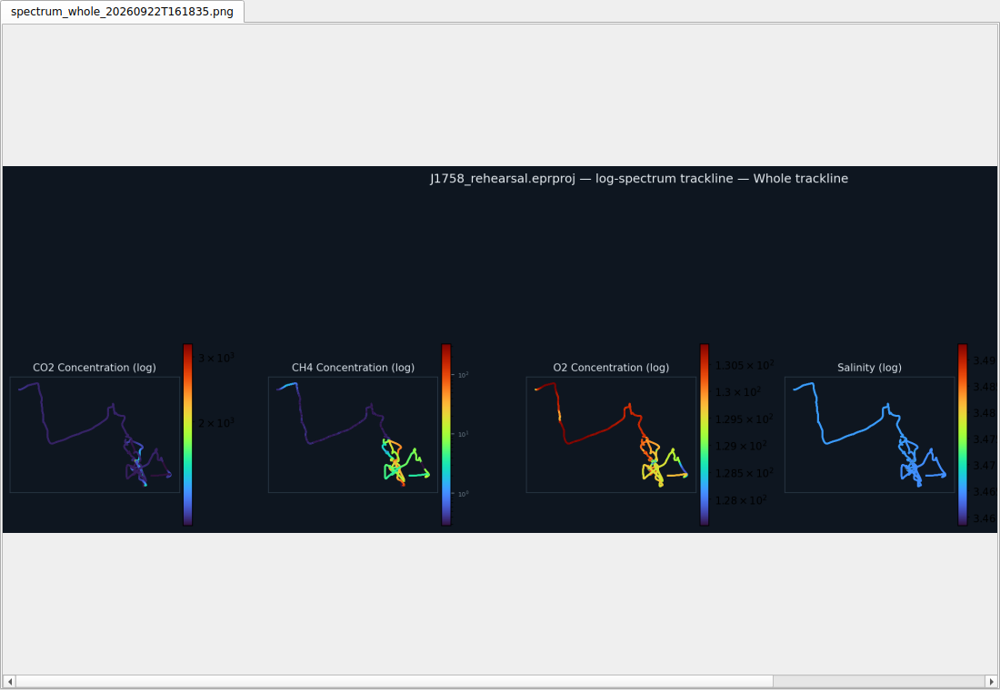

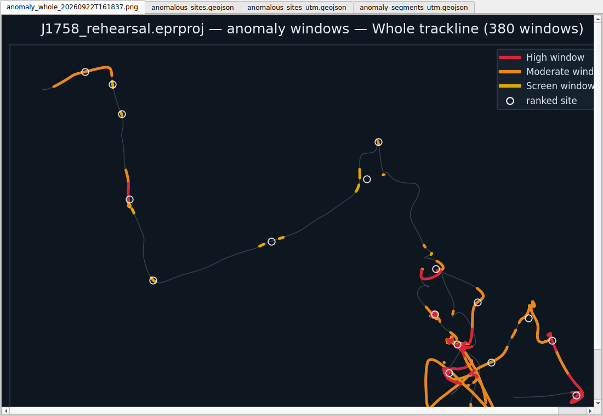

### 6.9 Frame Set

1. The sampling grid (4.3) is cut to the job's intervals and to the span with real navigation.
2. Times already covered by an existing frame within **0.5 s** (the reuse tolerance) are linked from that frame. The rest are decoded from the video.
3. Covered and uncovered runs shorter than 15 samples are merged into their neighbours, so the set is not split into many tiny pieces.

Each contiguous run becomes a `segment_*` folder holding `frames/*.jpg` and an `interp.csv` manifest, which gives each frame's time, position, altitude, depth and heading. `set_meta.json` records the sampling, the intervals and the status. A set that is still being built, or that failed, is never listed or reused. The label reads, for example, `dynamic 0.25 m · 55 frames (55 reused) · 1 interval`.

Legacy frame sets from older batch runs appear under Whole trackline as `legacy segNN · N frames`. They were made before the sampling model existed and are not reused as a frame set by Photogrammetry or Fauna Detection.

### 6.10 Photogrammetry

Needs Windows Metashape Professional. The steps:

1. Uses the newest frame set of the job whose sampling matches the requested one, or builds one first.
2. **Altitude gate:** frames with altitude **above 8 m**, or unknown, are dropped. The gaps they leave split the frame list into spans, and spans shorter than 15 frames are dropped.
3. **Chunks:** each span is cut into chunks of **at most 350 frames**, aiming for 250–350. A longer span is split into near-equal parts.
4. **Metashape** runs one project with one chunk per group, using the adopted recipe:
   - alignment High, with navigation as a reference (0.1 m horizontal and 0.05 m vertical accuracy) and rotation priors (30°)
   - pooled fixed camera calibration
   - dense cloud at Low quality with a Moderate depth filter
   - height-field mesh (Medium)
   - DEM, and an orthomosaic on the DEM
   - a PDF report
5. For the Whole trackline, the chunk orthomosaics and DEMs are merged into `survey/photogrammetry/merged/ortho_merged.tif` and `dem_merged.tif`. The previous merged files are moved to `_superseded/` first.

Each chunk folder holds:

- `orthomosaic.tif`
- `dem.tif`
- `sparse.ply`
- `dense.ply`
- `mesh.obj`
- `report.pdf`
- `preview_ortho.png`, when made

`run_status.json` records `ok`, `partial` or `failed`. A partial run's label ends `[n/m chunks reconstructed]`, and failed runs are not listed. **DEM heights show relative relief only**: the vertical datum is not consistent between chunks and the navigation (chapter 8).

### 6.11 Fauna Detection

Needs torch, ultralytics and the weights file.

**Detection.**

- Runs the MBARI FathomNet 315k **YOLOv8** detector (499 classes, zero-shot) on every frame of a matching frame set, one segment at a time.
- Inference size is 1280 px.
- Detections below a confidence of **0.25** are discarded. Per-bucket thresholds from `deploy_config.json` can be switched on instead; detections below them are kept in the raw table and marked `below_conf`.

**Buckets and exclusions.**

- Each class is mapped to a coarse **bucket**: crustacean, worm, fish, anemone or unknown.
- Classes that cannot be on this seafloor (pelagic or midwater animals, surface birds, plankton) are marked `excluded = midwater`.
- Substrate, gear and dead material are marked `excluded = nonfauna`.
- Excluded rows stay in `fathomnet_detections.csv` but are left out of every map and density.

**Position.** Each kept detection is placed at its **frame's** navigation position (EPSG:32613). Its true position is the frame centre ± about 3 m.

**Density.**

- A frame's seafloor footprint is taken as **0.63 × alt² m²** (frame width = 1.06 × altitude, aspect 2988/5312).
- Densities (`dens_<bucket>`, detections per m²) are computed **only for frames with 3 m ≤ altitude ≤ 8 m, and altitude ≠ 0.6 m** (the dropout value).
- Outside that band, densities are NaN and `alt_valid` is False.
- Counts are **frame detections, not individuals**: overlapping frames detect the same animal again.

**Output files.**

| File | What it holds |
|---|---|
| `fathomnet_detections.csv` | every detection, including excluded ones, with the reason |
| `fauna_points_utm.geojson` | kept detections |
| `fauna_density.csv` | one row per frame: counts, footprint, density |
| `fish_frame_shortlist.csv` | frames ranked by fish detections |
| `occurrences.csv` | detections joined to anomaly windows |
| `fauna_vs_anomaly.png` | in-window vs out-of-window comparison, made only when anomaly windows exist |
| `fauna_density_timeseries_v2.png` | density over time |
| sidecar `.meta.json` / `fauna_provenance.json` | column notes, model, weights and settings |

**Census vs other runs.** A Whole-trackline run at the default sampling is the **census**. It is built in a staging folder, and only when it completes is it moved into `survey/fauna/`, with the previous census moved to `_superseded/`. Every other run writes its own folder.

> **Species labels are unaudited.** The class names (`cls`, e.g. *Sebastolobus*) are zero-shot model output on imagery the model was not trained on. Only the coarse **bucket** was checked. Use the bucket level; treat species names as "model label, unaudited". The CSV viewer repeats this warning above the detections table.

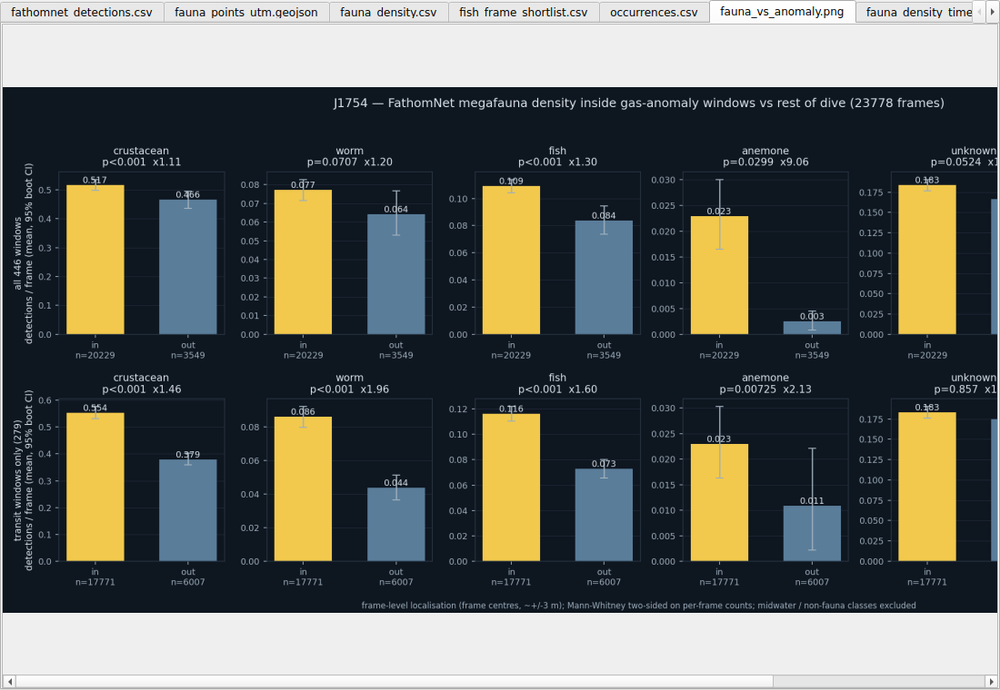

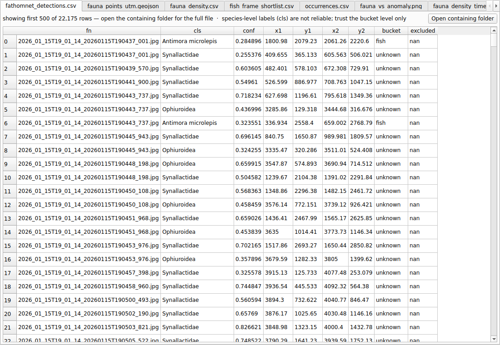

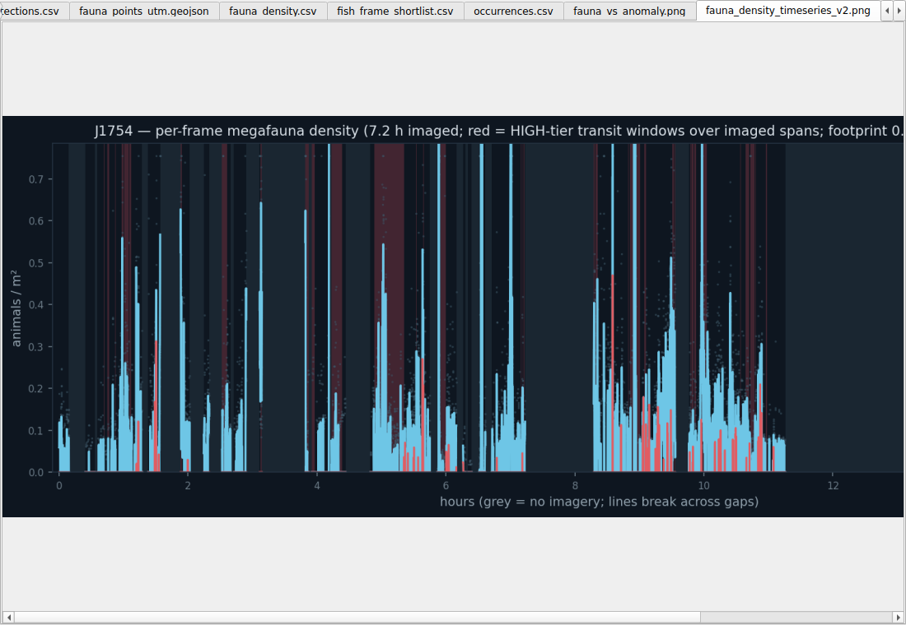

### 6.12 Survey Report

A self-contained HTML document with embedded figures. It covers the photogrammetry, a survey map, the anomaly detection, the sensor products and the processing methods. It **requires `survey/photogrammetry/merged/ortho_merged.tif`**, so photogrammetry must have run on the Whole trackline first. Its content is always the whole dive. Generating it under a job only changes where the file is written. The previous `SURVEY_REPORT.html` is moved to `_superseded/` first. **Fast mesh stats** (on by default) estimates mesh vertex and face counts from file size instead of reading every mesh file.

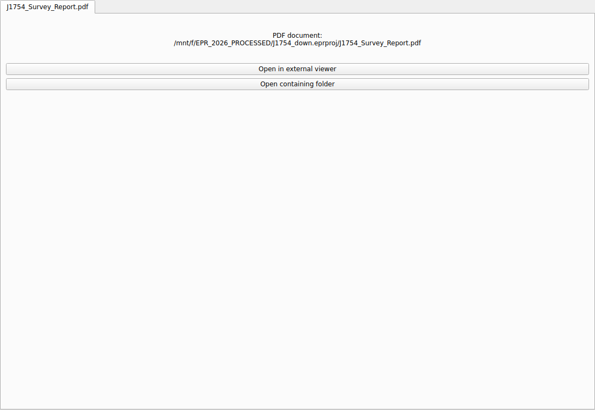

---

## 7. Troubleshooting and degraded modes

### 7.1 What each missing piece looks like

Every failure appears in the Log as one red `!!` line naming the cause. In Run all products the other steps still run, and the verdict line lists the failed ones.

| Missing or broken | What fails | What the log says (abridged) | What to do |
|---|---|---|---|
| A required Python package | the app, or every product | `product_catalog unavailable — ModuleNotFoundError: …` at start-up | install `requirements.txt` into the environment the launcher uses |
| Metashape (Windows) | Photogrammetry; then Survey Report | `!! photogrammetry FAILED: RuntimeError: No Metashape found. Install Agisoft Metashape Professional …` and later `survey report needs the merged orthomosaic (…); run photogrammetry (and the ortho merge) for this dive first` | install and activate Metashape Pro on Windows (2.2) |
| MATLAB not on PATH | Anomaly Detection; then the Anomaly Trackline has no windows, and the fauna window comparison is skipped | `!! anomaly detection FAILED: RuntimeError: MATLAB unavailable: MATLAB was not found on PATH …` | put `matlab` on PATH (2.2 step 8) |
| MATLAB not signed in | Anomaly Detection | see [7.3](#73-matlab-sign-in) | sign in once, or use a licence file |
| Fauna weights | Fauna Detection | `detector weights not found: <path> (from …). Set the environment variable EPR_FAUNA_WEIGHTS to the path of mbari_315k_yolov8.pt, or enter it under Detector weights` | set `EPR_FAUNA_WEIGHTS` and relaunch |
| ultralytics / torch | Fauna Detection | `No module named 'ultralytics'`; `note: torch unavailable (…) — CPU inference` | install torch first, then `requirements.txt` |
| No usable GPU | nothing fails; fauna is slower | `device: cpu (no CUDA)` and `note: CPU inference — batch reduced to 2 and this will be slow` | install the NVIDIA driver (on WSL: the Windows driver) |
| pyproj | anomaly UTM layers only | `note: UTM layers failed: …` | `pip install pyproj` |
| pyvista / pyvistaqt | the full 3-D window only | "Open in 3-D viewer" greyed out; the preview still works | optional |
| Chrome / Chromium / Edge | nothing; plainer catalogue | `chrome: not found — falling back to matplotlib` | optional |
| No desktop file handler (WSL without `xdg-open`) | opening PDFs/HTML outside the app | a "No external viewer" message | use Open containing folder |
| No anomaly windows yet | fauna comparison only | `note: no anomaly window table for this workspace — anomaly detection has not run yet …` | run Anomaly Detection, then Fauna again if the comparison is needed |
| Another run in the same workspace | the new run | `another run is already working in this workspace (pid …); wait for it to finish. If that process is gone, delete <ws>/.epr_run.lock` | wait; delete the lock only if that process no longer exists |
| Raw inputs moved (workspace copied to another machine) | anything that re-reads raw data | file-not-found errors naming the old path | re-import navigation, video and sensors on this machine |
| Wrong video filename format | Frame Set, and so Photogrammetry and Fauna | the frame-set step fails or yields no frames, because video start times are read from the filenames | fix the format under **File ▸ Import video…** |

**Partial installs.** What each level of installation still delivers:

| Installed | Products that work |
|---|---|
| Python packages only | 1 Hz table, Nav Trackline, Depth Raster, Sensor Rasters, Frame Sets, Spectrum Trackline, catalogue (matplotlib) |
| + torch/ultralytics + weights | + Fauna Detection (CPU works; GPU is fast) |
| + MATLAB with Signal Processing Toolbox | + Anomaly Detection, Anomaly Trackline, fauna × anomaly joins (+ pyproj → UTM layers) |
| + Windows Metashape Pro (via WSL) | + Photogrammetry and merged mosaics → + Survey Report |
| + pyvista/pyvistaqt with working OpenGL | + the full 3-D viewer |

### 7.2 Reading a failure

1. Find the red `!!` line. It says which step failed and why, in one line.
2. Press **Details…** for the traceback, if a developer needs it.
3. Fix the cause (table above). Then re-run only that product with **+ Generate new…**, or run all products again. Products that succeeded are not affected by a failed step.

### 7.3 MATLAB sign-in

The app calls `matlab -batch` without a keyboard, so a MATLAB that wants an interactive MathWorks sign-in cannot continue. The app recognises this in two ways:

- MATLAB prints a sign-in or licensing message. The step fails at once with: *"… could not start: this MATLAB uses ONLINE licensing and is not signed in to a MathWorks Account. Run `matlab` once interactively and sign in (or install a licence file), then retry."*
- MATLAB prints nothing for 420 s. The run is killed with: *"… produced no output in 420s and was killed — MATLAB did not get as far as the script. The usual cause is licensing …"*

Fix: start `matlab` once in a terminal and sign in, or point `MLM_LICENSE_FILE` at a licence file. **At sea, use an offline licence file.** An online licence cannot sign in without a network.

### 7.4 Stale inputs: when the 1 Hz table is rebuilt

The 1 Hz table depends on the navigation and sensor imports. The app keeps it consistent in two ways.

- **On re-import.** If you change the navigation or a sensor channel, the app renames `interp_full.csv` to `interp_full.stale.csv` and logs a note that it will be rebuilt on the next run. The map keeps showing the old track until then. A video re-import does not affect the table.
- **At every run.** Before using the table, a run compares the recorded input fingerprint with the current imports. If they differ, it logs `interp_full.csv is stale — <reason>. Rebuilding.` It then moves the old table to `_superseded/<stamp>/` and builds a new one. If the rebuild fails, the old table is put back, and the next run tries again.

Products made from the old table are **not** remade automatically. Regenerate the ones you need.

If you open an old workspace whose table predates fingerprinting, the log says the table was *adopted as-is*. Delete `inputs/interp_full.csv` to force a clean rebuild.

### 7.5 Recovering replaced files (`_superseded/`)

Canonical files are never overwritten in place. These are:

- the fauna census
- the anomaly catalogue
- the merged orthomosaic and DEM
- `SURVEY_REPORT.html`
- a stale `interp_full.csv`

Before a run replaces any of them, the old versions are moved to `<workspace>/_superseded/<UTC stamp>/`, keeping their paths relative to the workspace. `superseded.json` in that folder records the reason and every `from` → `to` move.

- **If the replacement fails**, the app puts the originals back by itself. Any partial new output is kept in `<stamp>/_failed_partial/`, and the log says `replacement failed — previous files restored`.
- **To go back to an earlier version by hand**, first move the current files aside yourself. Then move the files from `_superseded/<stamp>/…` back to the `from` paths listed in `superseded.json`.
- `_superseded/` is never cleaned automatically. Delete old stamps when you are sure you do not need them.

Rasters, spectrum and anomaly maps, frame sets, photogrammetry runs and job products are never replaced: every run writes a new folder or file beside the old ones.

### 7.6 Other messages

- **"refusing to save over workspace.json: it could not be read at startup"**: the workspace file is damaged. The app will not overwrite it, and it also refuses job changes. Repair or move the file, or use **File ▸ Save workspace as…**.
- **"ignored: that click is N px from the track"**: click on the line, or zoom in first.
- **"rejected … outside this dive"** / **"note: interval clipped to the dive"**: typed or clicked times beyond the navigation span.
- **"delete refused"** for a job: the job still owns products. Rename it instead.

---

## 8. Known limitations

These are known and accepted for this delivery. Each one is recorded in `docs/POST_DELIVERY.md`.

**Operation**

- **Runs cannot be stopped from the app.** The Stop button is disabled. Metashape and MATLAB have their own watchdogs, which kill a stuck process and log the reason.
- **There is no disk-space check** before frame extraction or photogrammetry. Make sure there is room first.
- **Frame extraction is slower than it needs to be**: it seeks the video separately for every frame.
- The product tree is rebuilt on the main thread after each task, so the window can pause briefly on large workspaces.
- Opening a workspace can write a small `interp_full.meta.json` beside an old table (the "adopted" note in 7.4).
- Only the **dynamic** sampling technique exists.
- There is no tool to rewrite a moved workspace's input paths; re-import instead.

**Data and products**

- **Older 1 Hz tables contain held positions** at the start and end of the dive, where the navigation was extended beyond its real span. They are ignored when read, and fauna densities outside the 3–8 m altitude band are NaN. A table rebuilt from scratch does not have them.
- **DEM heights are relative relief only.** The vertical sign and datum are not yet consistent between chunk DEMs, the depth raster and the tables.
- **Sensor rasters (IDW/RBF) fill the whole rectangle around the track.** They extrapolate away from the data, have no distance-to-data mask, and do not clip negative values. They are not a synoptic field.
- **Fauna counts are frame detections, not individuals.** No animal is tracked across frames.
- **Species labels are unaudited** zero-shot output (6.11). The exclusion list of impossible taxa is not complete.
- Statistics over frames (fauna vs anomaly, report cross-sections) treat overlapping frames as independent. They are descriptive only.
- Anomaly **site IDs are unique only within a dive**, not across dives. The catalogue does not yet state per-channel baselines or tier definitions.

**Records and provenance**

- Provenance is partial. Sidecars record code version, input paths, sizes and times, and the detector weights (with a checksum). They do not record checksums of the navigation and sensor inputs, the renavigation correction, or the Metashape and ultralytics versions.
- File-name stamps, instance labels and some metadata times are local clock; data times are UTC (6.1).
- Only the fauna density and occurrence tables carry column notes. Other products have no data dictionary.
- A crashed raster or fauna run may still be listed in the tree. Photogrammetry runs record their status and are filtered; the other product types are not yet.
